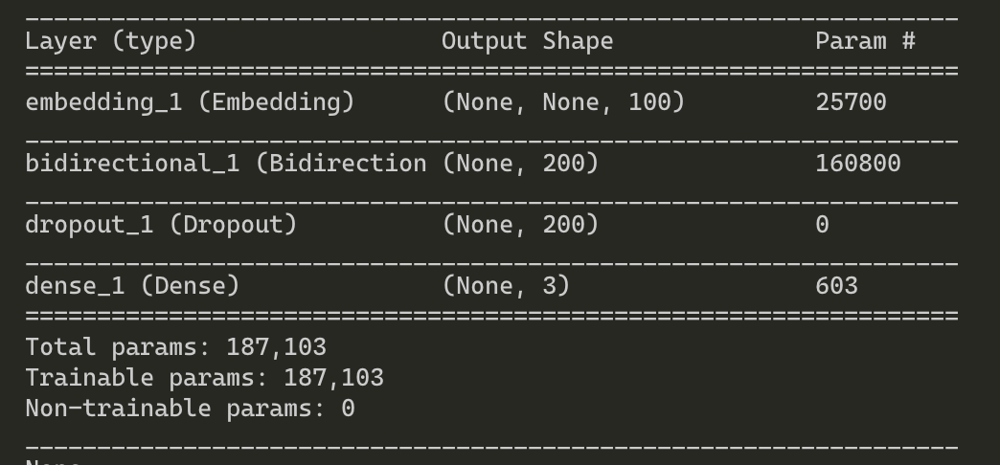
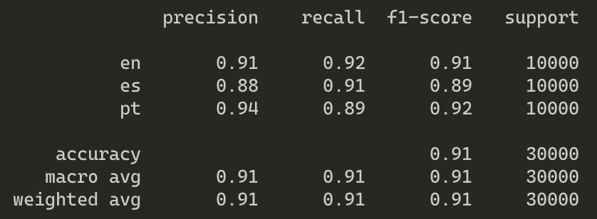
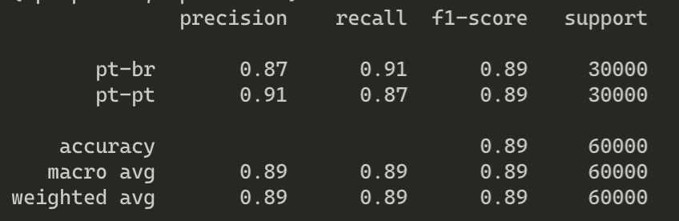
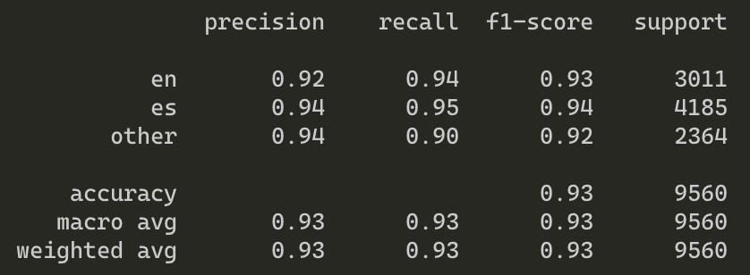

# AI Coding Challenge

This document describes the setup, work done, how to run the code and where to find the final results

## Setup

Make sure you have the follow:

+ Python 3.6
+ virtualenv
+ make

Steps to setup:

+ Create a virutal environment `make venv`

+ Switch to virtual environment `make active`

+ Install requirements `make dep`

## Task 1: Language Identification

Implement a Language Identification service that returns the language code of the language in which the text is written.

### Model

### How to run

#### Create subset of dataset

This script needs two arguments arg1 and arg2 both being numbers.

**arg1**: number of traininig samples to pick for each class.

**arg2**: number of dev samples to pick for each class.

`sh task_1_create_small_dataset.sh 20000 10000`

#### Train

`python task1.py --mode train`

#### Test on dev data

`python task1.py --mode test`

#### Predict and store results to [file](langid/langid.test_labels)

`python task1.py --mode predict`

### Results

## Task 2: Language Variants Identification

### Model

### How to run

#### Create subset of dataset

This script needs two arguments arg1 and arg2 both being numbers.

**arg1**: number of traininig samples to pick for each class.

**arg2**: number of dev samples to pick for each class.

`sh task_2_create_small_dataset.sh  30000 30000`

#### Train

`python task2.py --mode train`

#### Test on dev data

`python task2.py --mode test`

#### Predict and store results to [file](langid/langid-variants.test_labels)

`python task2.py --mode predict`

### Results

## Task 3: Code Switching Detection

### Model

### How to run

#### Train

`python task3.py --mode train`

#### Test on dev data

`python task3.py --mode test`

#### Predict interactively

`python task3.py --mode predict`

### Results

