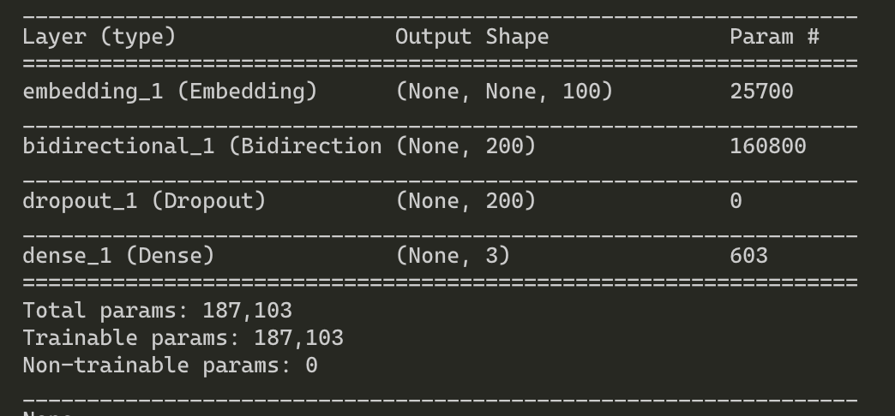
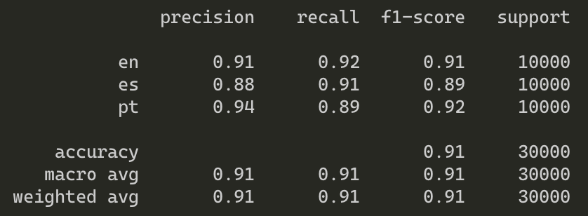
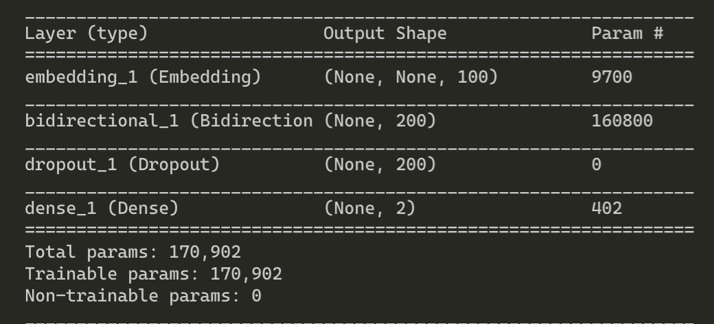
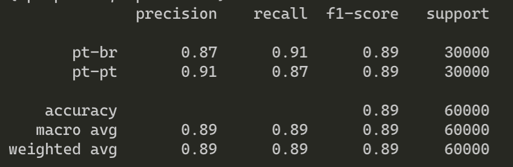
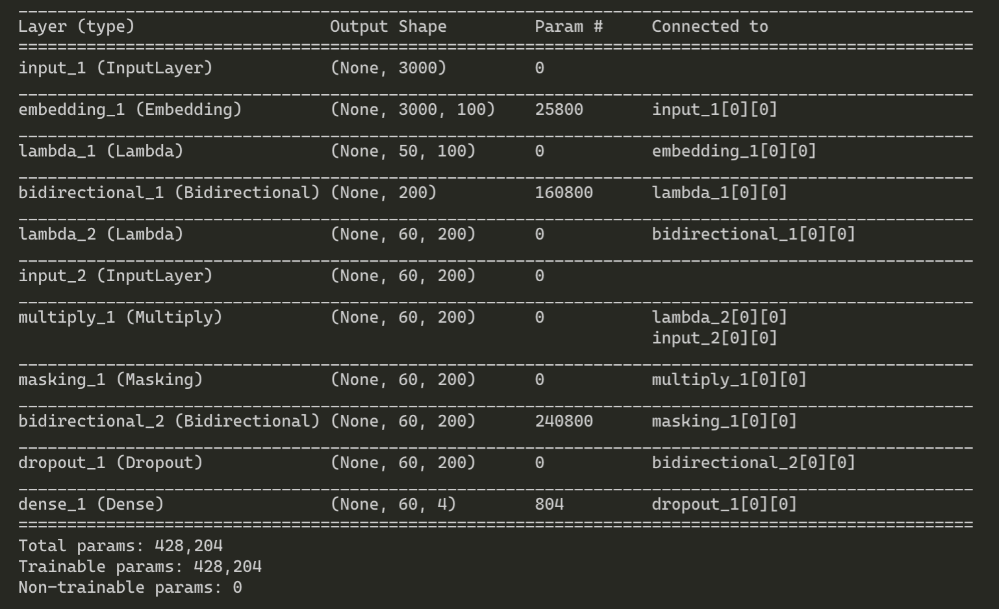
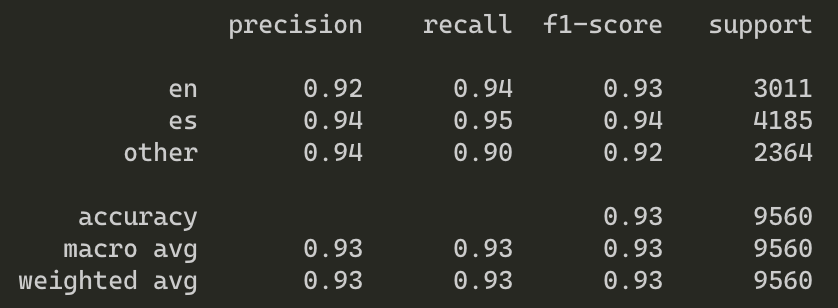

# Language Identification

## Tasks

1 - Implement a Language Identification service that returns the language code of the language in which the text is written. The provided data and test will
target Spanish (ES), Portuguese (PT-PT) and English (EN)

2 - Train the system to distinguish between language variants. In this case we wish to distinguish between European Portuguese (PT-PT) and Brazilian Portuguese (PT-BR)

3 - Implement a deep learning model (recommended: a BILSTM tagger) to detect code switching (language mixture) and return both a list of tokens and a list with one language label per token.
To simplify we are going to focus on English and Spanish, so you only need to return for each token either 'en', 'es' or 'other'

*See more information about tasks 1 and 2 in langid folder, and about task3 in code_switching folder*

## Setup

Make sure you have the following:

+ Python 3.6
+ virtualenv
+ make

Steps to setup:

+ Create a virutal environment `make venv`

+ Switch to virtual environment `source venv/bin/activate`

+ Install requirements `make dep`

All models are coded in Keras with Tensorflow backend.

## Task 1: Language Identification

Implement a Language Identification service that returns the language code of the language in which the text is written.

### Model

This model is a char-level model, meaning its input is a sequence of characters rather than words.

The number of input characters is limited to 256 since that covers most character variations occuring in English, Spanish and Portugese.
In order to keep the training time short all sentences are trimmed (and padded if necessary) to a maximum length of 200 characters.
The mean and median lengths of sentences in characters is ~130, ~105 respectively.

The model has a char-level embedding layer and a single layer BiLSTM followed by a FC Layer. The weights for all 3 layers are initialized randomly and learnt during the training.

### How to run

#### Create subset of dataset

This script needs two arguments arg1 and arg2 both being numbers.

**arg1**: number of traininig samples to pick for each class.

**arg2**: number of dev samples to pick for each class.

`sh task_1_create_small_dataset.sh 20000 10000`

#### Train

`python task1.py --mode train`

#### Test on dev data

`python task1.py --mode test`

#### Predict and store results to [file](langid/langid.test_labels)

`python task1.py --mode predict`

### Results

These are the results on the dev data [here](langid-data-small/task1/test)

## Task 2: Language Variants Identification

### Model

This model is a char-level model, meaning its input is a sequence of characters rather than words.

The number of input characters is limited to 96 since that covers most character variations occuring in both variants of Portugese. 
In order to keep the training time short all sentences are trimmed (and padded if necessary) to a maximum length of 200 characters.
The mean and median lengths of sentences in characters is ~115, ~100 respectively.

The model has a char-level embedding layer and a single layer BiLSTM followed by a FC Layer. The weights for all 3 layers are initialized randomly and learnt during the training.

### How to run

#### Create subset of dataset

This script needs two arguments arg1 and arg2 both being numbers.

**arg1**: number of traininig samples to pick for each class.

**arg2**: number of dev samples to pick for each class.

`sh task_2_create_small_dataset.sh  30000 30000`

#### Train

`python task2.py --mode train`

#### Test on dev data

`python task2.py --mode test`

#### Predict and store results to [file](langid/langid-variants.test_labels)

`python task2.py --mode predict`

### Results

These are the results on the dev data [here](langid-data-small/task2/test)

## Task 3: Code Switching Detection

### Model

This model is a char-level model, meaning its input is a sequence of characters rather than words.

The number of input characters is limited to 257 (including the special 'unk' character ) since that covers many common characters in English and Spanish. The idea is to let the 'unk' character handle the numerous Unicode characters that may appear. Since our task is to only distinguish between other/en/es and not really understand the meaning of individual Unicode characters. By limiting the number of characters, we can limit the model size while not giving up on performance.

In order to keep the training time short all tokens are trimmed to a maximum length of 50 characters and all tweets are trimmed to a maximum length of 60 tokens. Padding is applied at both word and character levels as necessary.
The max length of any token appearing in training data in characters is ~50.
The max length of any tweet appearing in training data in tokens is ~50.

This model has a 2 levels of BiLSTM, one processing the characters in every word and generating hidden word representations while the other works on the hidden word representations and learns to distinguish them. These layers are followed by a FC layer to project onto the output vector space. The weights for all the layers are initialized randomly and learnt during the training.

Additionally, we make use of masking technique to hide the padding added at the end of input sequence (from weight learning and loss computation process). The masks are applied to the character embeddings and to the hidden word representations.

### How to run

#### Train

`python task3.py --mode train`

#### Test on dev data

`python task3.py --mode test`

#### Predict interactively

`python task3.py --mode predict`

### Results

These are the results on the dev data [here](code_switching/data/dev_data.tsv)

